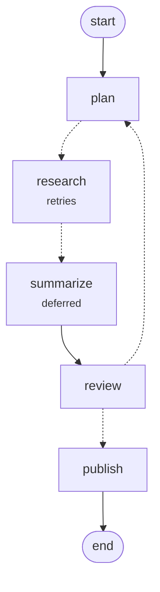

# Graphs

<!-- covers: ./graph ./graph/visualize -->

Stateful graphs from `nexus-ai-pro/graph`: typed channels, parallel branches, conditional and deferred edges, interrupts for human input, checkpoints that survive a restart, time travel, subgraphs, per-node caching, and a Mermaid visualizer on `nexus-ai-pro/graph/visualize`. A graph-only application imports no third-party package.

## Overview

A graph is nodes, edges, and typed state. Cycles, fan-out, subgraphs, and human approval are
supported shapes rather than workarounds, and every run is checkpointed, so it is resumable by
construction rather than after configuring a checkpointer.

```ts
import { createGraph, appendList, counter, END, MemoryGraphCheckpointer } from 'nexus-ai-pro/graph';

const graph = createGraph({
  channels: { messages: appendList<string>(), turns: counter() },
})
  .addNode('research', async (ctx) => ({ messages: [await search(ctx.state.messages)], turns: 1 }))
  .addNode('answer', async (ctx) => ({ messages: [await ai.complete(...).then((r) => r.content)] }))
  .setEntry('research')
  .addConditionalEdges('research', (state) => (state.turns >= 3 ? 'answer' : 'research'))
  .addEdge('answer', END)
  .compile({ checkpointer: new MemoryGraphCheckpointer() });

const result = await graph.invoke({ messages: ['who won?'] }, { threadId: 'q-42' });
```

**Channels, not assignment.** Each state slot declares how writes combine — `lastValue`,
`appendList`, `appendSet`, `mergeObject`, `counter`, or your own `reducerChannel`. That is what makes
fan-out safe: two branches running in the same superstep can both write, and the channel decides
whether that means overwrite, append, or sum. Assignment would silently drop one branch's work.

**Cycles are first-class**, so `maxSteps` is what stands between a mistaken router and an infinite
loop. Exceeding it names the nodes still pending rather than hanging.

**Branches run in parallel.** Every task in a superstep starts together, so four branches of three
seconds each finish in about three seconds rather than twelve:

```ts
.addConditionalEdges('plan', () => ['research-a', 'research-b', 'research-c', 'research-d'])
```

`maxConcurrency` caps how many run at once — 16 by default, settable per compile and per run, and
`1` restores strictly sequential execution. Whatever the timing, writes are reduced in task order, so
a replay produces the same state. A superstep with one task skips the scheduler entirely.

**Fan out over data decided at run time.** Edges can only name nodes that already exist. `Send`
creates one task per value instead, each reading its own `context.input`:

```ts
import { Send } from 'nexus-ai-pro/graph';

.addNode('research', async (ctx) => ({ findings: [await fetch(ctx.input as string)] }), { ends: [END] })
.addConditionalEdges('plan', (state) => state.urls.map((url) => new Send('research', url)))
```

Fifty-seven URLs become fifty-seven tasks of one node in a single superstep, bounded by
`maxConcurrency` and checkpointed individually, so a resume re-runs only the copies that did not
finish. Declaring `ends` keeps compile-time reachability checks exact.

**Retries and timeouts per node.** A node that calls a flaky service can retry on its own, without
wrapping every node body in the same try/catch:

```ts
.addNode('fetch', fetchNode, {
  retry: { maxAttempts: 3, initialIntervalMs: 500, backoffFactor: 2, jitter: true },
  timeoutMs: 10_000,
})
```

Retrying defaults to off, because only you know whether a node is idempotent; `compile({ retry })`
sets a default for every node. Interrupts, aborts, and validation errors are never retried.
`context.attempt` tells a node which try it is on, and a timeout aborts the node's signal and fails
that attempt. When one task fails, its siblings are aborted by default; `onNodeError: 'settle'` lets
them finish first, and either way what they already wrote is kept.

**Several questions at once.** Parallel tasks can each interrupt. The paused result carries every
pending question, and they can be answered together or a few at a time:

```ts
const run = await graph.invoke(input, { threadId });
await graph.resumeInterruptsWith(threadId, {
  [run.interrupts[0].id]: true,
  [run.interrupts[1].id]: 'use the second draft',
});
```

**Human in the loop.** A node calls `interrupt()`; the graph checkpoints and stops:

```ts
.addNode('approve', (ctx) => ({
  approved: ctx.interrupt<boolean>({ reason: 'Publish this draft?', payload: { chars: 1200 } }),
}))
```

```ts
const run = await graph.invoke(input, { threadId });
if (run.status === 'awaiting_input') {
  // Hours later, in another process:
  await graph.resumeWith(threadId, true);
}
```

The interrupted node runs again from the top and `interrupt()` returns the supplied value instead of
throwing, so the node body reads as straight-line code either way. Keep the work before an interrupt
cheap, because it happens twice. A sibling branch that already finished is **not** re-run — its
writes were checkpointed before the graph suspended.

**Time travel and inspection.** Every superstep is a checkpoint:

```ts
await graph.state(threadId);        // latest checkpoint
await graph.history(threadId);      // newest first
graph.resumeFrom(threadId, 3);      // rewind and run forward
```

**Route from inside a node.** When a node already knows where to go — an agent that just picked a
tool, a triage step that classified a ticket — return a `Command` instead of splitting the decision
into a separate router:

```ts
import { Command } from 'nexus-ai-pro/graph';

.addNode('triage', (ctx) =>
  new Command({ update: { label: classify(ctx.state) }, goto: isUrgent(ctx.state) ? 'page-oncall' : 'queue' }),
  { ends: ['page-oncall', 'queue'] },
)
```

`goto` takes node names or `Send`s, and `ends` keeps compile-time checks and diagrams exact. A node
inside a subgraph can return `new Command({ graph: Command.PARENT, goto: 'human' })` to hand control
back to the graph that contains it — how a nested agent escalates.

**Aggregate after branches of different lengths.** `{ defer: true }` holds a node until every other
pending task has finished, so an aggregator after a two-step branch and a one-step branch runs once,
after both, rather than once per arrival.

**Pause for inspection.** Breakpoints stop a run before or after chosen nodes, checkpointed, without
changing the nodes themselves:

```ts
const graph = builder.compile({ interruptBefore: ['publish'] });
const paused = await graph.invoke(input, { threadId });   // status: 'interrupted', breakpoint: { when: 'before', ... }
await graph.updateState(threadId, { draft: fixedDraft }); // correct something first, if needed
for await (const _ of graph.continue(threadId)) {}         // then carry on
```

Set them per compile or per run; a run's list replaces the compiled one.

**Edit state, or fork a thread.** `updateState(threadId, update)` merges a correction into the latest
checkpoint through the channel reducers, leaving any pending question in place.
`updateState(threadId, update, { asNode: 'research' })` applies it as if that node had produced it,
so the next step follows that node's edges. `fork(threadId, { step })` copies the history up to a step
into a new thread and leaves the original untouched, so two answers to the same question can be run
side by side.

**Watch it run.** `onEvent` receives every task starting, retrying, and finishing with its update,
every checkpoint written, and whatever a node passes to `context.emit()` — model tokens as they
stream, a status line, an intermediate result:

```ts
.addNode('write', async (ctx) => {
  for await (const token of streamAnswer(ctx.state)) ctx.emit({ token });
  return { answer };
})

await graph.invoke(input, {
  onEvent: (event) => event.type === 'custom' && process.stdout.write((event.data as { token: string }).token),
});
```

A listener that throws never fails the run it is watching.

**See the shape.** `graph.describe()` returns nodes, edges, and which routes are decided at run
time, as plain JSON. `toMermaid()` from `nexus-ai-pro/graph/visualize` draws it — solid arrows are
always taken, dotted ones are chosen at run time, and subgraphs are drawn inside the node that runs
them:

```ts
import { toMermaid } from 'nexus-ai-pro/graph/visualize';

console.log(toMermaid(graph, { highlight: checkpoint.next }));
```

This diagram is that function's actual output for a research-and-review graph:



The visualizer is its own subpath and imports no runtime code, so drawing a graph costs nothing to an
application that only runs one. No image renderer is bundled; any Mermaid renderer turns the output
into PNG or SVG.

**Durable by construction.** The default checkpointer is in-process, holding up to 1,000 threads;
pass `checkpointer: false` to turn checkpointing off. Point it at the operation store
that already backs durable operations and a thread survives a restart — a different worker resumes
what another suspended:

```ts
import { OperationStoreCheckpointer } from 'nexus-ai-pro/graph';
import { RedisOperationStore } from 'nexus-ai-pro/operations/adapters';

const checkpointer = new OperationStoreCheckpointer(new RedisOperationStore(redis));
```

Writes are compare-and-set on the record's sequence, so two workers advancing the same thread cannot
both win. `PostgresOperationStore` works the same way; see [Postgres](./postgres.md).

**Subgraphs.** A compiled graph is a node:

```ts
parent.addNode('research', researchGraph.asNode());
```

Channels shared by name are passed in and merged back; anything the parent does not declare stays
private to the subgraph.

**Input and output channels.** Working channels can stay internal:

```ts
const research = createGraph({
  channels: { question: lastValue(''), notes: appendList<string>(), answer: lastValue('') },
  input: ['question'],
  output: ['answer'],
});
```

`invoke()` accepts only `question` and returns only `answer`, in the types as well as at run time. As
a subgraph it receives only its inputs from the parent and merges back only its outputs, so a parent
with its own `notes` channel never sees these. Checkpoints, `state()`, and stream events still carry
the whole state, because they describe the thread rather than answer the caller.

**Caching node results.** An expensive node whose result depends only on what it reads can skip work
it has already done:

```ts
graph.addNode('classify', classifyTicket, {
  cache: { ttlMs: 10 * 60_000, key: ({ state }) => `classify:${(state as Ticket).body}` },
});
```

The default key hashes the graph name, the node, the state it sees, and its `Send` input — always
correct, sometimes too specific, which is what `key` is for. Results live in a bounded in-process map
by default, or in any cache adapter: `compile({ cache: new RedisCacheAdapter(redis) })` shares them
across workers. A failure, an interrupt, a node that consumed a human's answer, and a command for a
parent graph are never cached, and a cache that is down is a miss rather than a failed node. The
caching code loads the first time a caching node runs.

The graph is not in the root import. It costs nothing to a user who does not build graphs.

<!-- reference:start -->
## Reference

Generated from the doc comments by `npm run docs:update`. Each export is listed once, under the most
specific entry point that provides it.

### `nexus-ai-pro/graph`

| Export | Kind | Summary |
| --- | --- | --- |
| `appendList` | function | Concatenates every write, which is what a message history or an event log wants. |
| `appendSet` | function | Keeps distinct values in first-seen order. |
| `Channel` | interface | One slot of graph state, plus the rule for combining writes into it. |
| `ChannelSchema` | type | A graph's state channels, by name. |
| `Command` | class | Updates state and chooses what runs next, in one return value. |
| `CommandTarget` | type | Where a `Command` sends control. |
| `CompiledGraph` | class | A validated graph, ready to run. |
| `CompileOptions` | interface | Options applied when a graph is compiled: stores, breakpoints, concurrency, retries, and failure handling. |
| `counter` | function | Sums numeric writes, for a counter several branches increment. |
| `createGraph` | function | Starts a graph definition. |
| `EdgeRouter` | type | Chooses where to go after a node. |
| `END` | constant | Terminal sentinel. |
| `GraphBreakpoint` | interface | Where a run paused for debugging. |
| `GraphCheckpoint` | interface | A graph's full state after a superstep, which is everything needed to resume the run elsewhere. |
| `GraphCheckpointer` | interface | Durable storage for checkpoints. |
| `GraphDescription` | interface | A graph's shape, as data: what `describe()` returns and what the visualizer draws. |
| `GraphError` | class | Base class for graph errors, each with a stable `code`. |
| `GraphEvent` | type | Fine-grained events delivered to `GraphRunOptions.onEvent`. |
| `GraphInput` | type | What a caller may pass to `invoke()`: the graph's input channels, or every channel by default. |
| `GraphInterrupt` | class | Thrown by `context.interrupt()` to suspend the graph. |
| `GraphNodeError` | class | Raised when a node throws. |
| `GraphNodeTimeoutError` | class | Raised when a node outlives its `timeoutMs`. |
| `GraphNotInterruptedError` | class | Raised when resuming a thread that is not awaiting input. |
| `GraphProgress` | interface | Progress a node reported through `context.report()`. |
| `GraphResult` | interface | The outcome of a run. |
| `GraphRouteTarget` | type | What a router may return: node names, `Send`s, or a mix of both. |
| `GraphRunOptions` | interface | Options for one run of a compiled graph. |
| `GraphStatus` | type | Where a run stands: running, paused to ask a human, finished, failed, or stopped at a breakpoint or by a signal. |
| `GraphStepEvent` | interface | One superstep, as seen by `stream()`. |
| `GraphStepLimitError` | class | Raised when a run exceeds its superstep budget. |
| `GraphTask` | interface | One unit of work in a superstep. |
| `GraphThreadNotFoundError` | class | Raised when a thread has no checkpoint to resume or inspect. |
| `GraphValidationError` | class | Raised when a graph definition is invalid: an unknown node, a missing entry point, or a bad channel. |
| `interruptKey` | function | Stable key for one interrupt, so a replayed node picks up the answer it was given. |
| `InterruptRequest` | interface | A request for human input, surfaced when a node interrupts. |
| `lastValue` | function | The last write wins. |
| `MemoryGraphCheckpointer` | class | In-process checkpoint history. |
| `MemoryGraphCheckpointerOptions` | interface | Options for the in-process checkpointer. |
| `mergeObject` | function | Shallow-merges object writes, so two branches can each contribute their own keys. |
| `NodeCacheEntry` | interface | A cached node result: the writes it made and where it routed. |
| `NodeCachePolicy` | interface | How a node reuses its results: the key, how long a result lasts, and where results are kept. |
| `NodeContext` | interface | What a node receives when it runs. |
| `NodeFn` | type | A node: reads state from its context and returns an update, a `Command`, or nothing. |
| `NodeOptions` | interface | How a node runs: retries, a timeout, where it may route, deferral, and caching. |
| `NodeResult` | type | What a node may return: an update, a `Command`, or nothing. |
| `OperationStoreCheckpointer` | class | Persists checkpoints through the `OperationStore` that already backs durable operations. |
| `OperationStoreCheckpointerOptions` | interface | Options for the operation-store checkpointer. |
| `PendingInterrupt` | interface | A question a node asked through `interrupt()`, waiting for an answer. |
| `reducerChannel` | function | Builds a channel from a plain reducer, for a rule none of the built-ins covers. |
| `RetryPolicy` | interface | How a node retries. |
| `Send` | class | Routes to one node with its own input, creating one task per value. |
| `START` | constant | Entry sentinel. |
| `StateGraph` | class | Builds a typed state graph. |
| `StateOf` | type | The state object a schema describes. |
| `StateUpdate` | type | What a node may write back. |

### `nexus-ai-pro/graph/visualize`

| Export | Kind | Summary |
| --- | --- | --- |
| `Describable` | type | Anything that can describe itself: a compiled graph, or a description already taken from one. |
| `MermaidOptions` | interface | Options for `toMermaid()`. |
| `toGraphJSON` | function | The description as JSON, for a UI or a test that wants the shape rather than a picture. |
| `toMermaid` | function | Renders a graph as a Mermaid flowchart. |
<!-- reference:end -->
