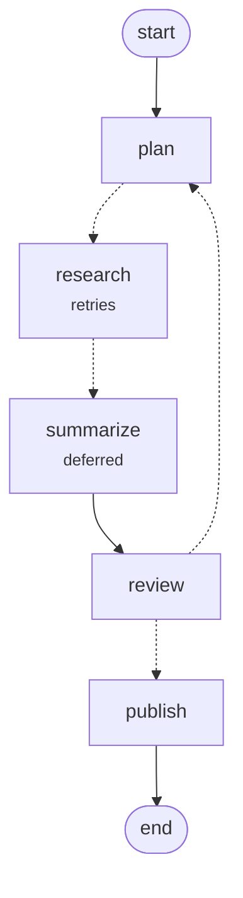

# Graphs

<!-- covers: ./graph ./graph/functional ./graph/visualize ./graph/lint -->

Stateful graphs from `nexus-ai-pro/graph`: typed channels, parallel branches, conditional and deferred edges, interrupts for human input, checkpoints that survive a restart, time travel, subgraphs, per-node caching, and a Mermaid visualizer on `nexus-ai-pro/graph/visualize`. A graph-only application imports no third-party package.

## Overview

A graph is nodes, edges, and typed state. Cycles, fan-out, subgraphs, and human approval are
supported shapes rather than workarounds, and every run is checkpointed, so it is resumable by
construction rather than after configuring a checkpointer.

```ts
import { createGraph, appendList, counter, END, MemoryGraphCheckpointer } from 'nexus-ai-pro/graph';

const graph = createGraph({
  channels: { messages: appendList<string>(), turns: counter() },
})
  .addNode('research', async (ctx) => ({ messages: [await search(ctx.state.messages)], turns: 1 }))
  .addNode('answer', async (ctx) => ({ messages: [await ai.complete(...).then((r) => r.content)] }))
  .setEntry('research')
  .addConditionalEdges('research', (state) => (state.turns >= 3 ? 'answer' : 'research'))
  .addEdge('answer', END)
  .compile({ checkpointer: new MemoryGraphCheckpointer() });

const result = await graph.invoke({ messages: ['who won?'] }, { threadId: 'q-42' });
```

**Channels, not assignment.** Each state slot declares how writes combine — `lastValue`,
`appendList`, `appendSet`, `mergeObject`, `counter`, or your own `reducerChannel`. That is what makes
fan-out safe: two branches running in the same superstep can both write, and the channel decides
whether that means overwrite, append, or sum. Assignment would silently drop one branch's work.

**Cycles are first-class**, so `maxSteps` is what stands between a mistaken router and an infinite
loop. Exceeding it names the nodes still pending rather than hanging.

**Branches run in parallel.** Every task in a superstep starts together, so four branches of three
seconds each finish in about three seconds rather than twelve:

```ts
.addConditionalEdges('plan', () => ['research-a', 'research-b', 'research-c', 'research-d'])
```

`maxConcurrency` caps how many run at once — 16 by default, settable per compile and per run, and
`1` restores strictly sequential execution. Whatever the timing, writes are reduced in task order, so
a replay produces the same state. A superstep with one task skips the scheduler entirely.

**Fan out over data decided at run time.** Edges can only name nodes that already exist. `Send`
creates one task per value instead, each reading its own `context.input`:

```ts
import { Send } from 'nexus-ai-pro/graph';

.addNode('research', async (ctx) => ({ findings: [await fetch(ctx.input as string)] }), { ends: [END] })
.addConditionalEdges('plan', (state) => state.urls.map((url) => new Send('research', url)))
```

Fifty-seven URLs become fifty-seven tasks of one node in a single superstep, bounded by
`maxConcurrency` and checkpointed individually, so a resume re-runs only the copies that did not
finish. Declaring `ends` keeps compile-time reachability checks exact.

**Retries and timeouts per node.** A node that calls a flaky service can retry on its own, without
wrapping every node body in the same try/catch:

```ts
.addNode('fetch', fetchNode, {
  retry: { maxAttempts: 3, initialIntervalMs: 500, backoffFactor: 2, jitter: true },
  timeoutMs: 10_000,
})
```

Retrying defaults to off, because only you know whether a node is idempotent; `compile({ retry })`
sets a default for every node. Interrupts, aborts, and validation errors are never retried.
`context.attempt` tells a node which try it is on, and a timeout aborts the node's signal and fails
that attempt. When one task fails, its siblings are aborted by default; `onNodeError: 'settle'` lets
them finish first, and either way what they already wrote is kept.

**Several questions at once.** Parallel tasks can each interrupt. The paused result carries every
pending question, and they can be answered together or a few at a time:

```ts
const run = await graph.invoke(input, { threadId });
await graph.resumeInterruptsWith(threadId, {
  [run.interrupts[0].id]: true,
  [run.interrupts[1].id]: 'use the second draft',
});
```

**Human in the loop.** A node calls `interrupt()`; the graph checkpoints and stops:

```ts
.addNode('approve', (ctx) => ({
  approved: ctx.interrupt<boolean>({ reason: 'Publish this draft?', payload: { chars: 1200 } }),
}))
```

```ts
const run = await graph.invoke(input, { threadId });
if (run.status === 'awaiting_input') {
  // Hours later, in another process:
  await graph.resumeWith(threadId, true);
}
```

The interrupted node runs again from the top and `interrupt()` returns the supplied value instead of
throwing, so the node body reads as straight-line code either way. Keep the work before an interrupt
cheap, because it happens twice. A sibling branch that already finished is **not** re-run — its
writes were checkpointed before the graph suspended.

**Time travel and inspection.** Every superstep is a checkpoint:

```ts
await graph.state(threadId);        // latest checkpoint
await graph.history(threadId);      // newest first
graph.resumeFrom(threadId, 3);      // rewind and run forward
```

**Route from inside a node.** Sometimes a node already knows where to go: an agent that just picked a
tool, or a triage step that classified a ticket. Return a `Command` instead of adding a separate
router:

```ts
import { Command } from 'nexus-ai-pro/graph';

.addNode('triage', (ctx) =>
  new Command({ update: { label: classify(ctx.state) }, goto: isUrgent(ctx.state) ? 'page-oncall' : 'queue' }),
  { ends: ['page-oncall', 'queue'] },
)
```

`goto` takes node names or `Send`s, and `ends` keeps compile-time checks and diagrams exact. A node
inside a subgraph can return `new Command({ graph: Command.PARENT, goto: 'human' })` to hand control
back to the graph that contains it — how a nested agent escalates.

**Aggregate after branches of different lengths.** `{ defer: true }` holds a node until every other
pending task has finished. An aggregator after a two-step branch and a one-step branch then runs once,
after both, instead of once per arrival.

**Pause for inspection.** Breakpoints stop a run before or after chosen nodes, checkpointed, without
changing the nodes themselves:

```ts
const graph = builder.compile({ interruptBefore: ['publish'] });
const paused = await graph.invoke(input, { threadId });   // status: 'interrupted', breakpoint: { when: 'before', ... }
await graph.updateState(threadId, { draft: fixedDraft }); // correct something first, if needed
for await (const _ of graph.continue(threadId)) {}         // then carry on
```

Set them per compile or per run; a run's list replaces the compiled one.

**Edit state, or fork a thread.** `updateState(threadId, update)` merges a correction into the latest
checkpoint through the channel reducers, leaving any pending question in place.
`updateState(threadId, update, { asNode: 'research' })` applies it as if that node had produced it,
so the next step follows that node's edges. `fork(threadId, { step })` copies the history up to a step
into a new thread and leaves the original untouched, so two answers to the same question can be run
side by side.

**Watch it run.** `onEvent` receives every task starting, retrying, and finishing, and every
checkpoint written. It also receives whatever a node passes to `context.emit()`, such as model tokens
as they stream, a status line, or an intermediate result:

```ts
.addNode('write', async (ctx) => {
  for await (const token of streamAnswer(ctx.state)) ctx.emit({ token });
  return { answer };
})

await graph.invoke(input, {
  onEvent: (event) => event.type === 'custom' && process.stdout.write((event.data as { token: string }).token),
});
```

A listener that throws never fails the run it is watching.

**See the shape.** `graph.describe()` returns nodes, edges, and which routes are decided at run
time, as plain JSON. `toMermaid()` from `nexus-ai-pro/graph/visualize` draws it — solid arrows are
always taken, dotted ones are chosen at run time, and subgraphs are drawn inside the node that runs
them:

```ts
import { toMermaid } from 'nexus-ai-pro/graph/visualize';

console.log(toMermaid(graph, { highlight: checkpoint.next }));
```

This diagram is that function's actual output for a research-and-review graph:


```mermaid
flowchart TD
  __start__([start])
  __end__([end])
  n_plan["plan"]
  n_research["research<br/><small>retries</small>"]
  n_summarize["summarize<br/><small>deferred</small>"]
  n_review["review"]
  n_publish["publish"]
  __start__ --> n_plan
  n_summarize --> n_review
  n_publish --> __end__
  n_plan -.-> n_research
  n_research -.-> n_summarize
  n_review -.-> n_publish
  n_review -.-> n_plan
```

The visualizer is its own subpath and imports no runtime code, so drawing a graph costs nothing to an
application that only runs one. No image renderer is bundled; any Mermaid renderer turns the output
into PNG or SVG.

**Durable by construction.** The default checkpointer is in-process, holding up to 1,000 threads;
pass `checkpointer: false` to turn checkpointing off. Point it at the operation store
that already backs durable operations and a thread survives a restart — a different worker resumes
what another suspended:

```ts
import { OperationStoreCheckpointer } from 'nexus-ai-pro/graph';
import { RedisOperationStore } from 'nexus-ai-pro/operations/adapters';

const checkpointer = new OperationStoreCheckpointer(new RedisOperationStore(redis));
```

Writes are compare-and-set on the record's sequence, so two workers advancing the same thread cannot
both win. `PostgresOperationStore` and `SqliteOperationStore` work the same way; see
[Postgres](./postgres.md) and [SQLite](./sqlite.md).

**Subgraphs.** A compiled graph is a node:

```ts
parent.addNode('research', researchGraph.asNode());
```

Channels shared by name are passed in and merged back; anything the parent does not declare stays
private to the subgraph.

**Input and output channels.** Working channels can stay internal:

```ts
const research = createGraph({
  channels: { question: lastValue(''), notes: appendList<string>(), answer: lastValue('') },
  input: ['question'],
  output: ['answer'],
});
```

`invoke()` accepts only `question` and returns only `answer`, in the types as well as at run time. As
a subgraph it receives only its inputs from the parent and merges back only its outputs, so a parent
with its own `notes` channel never sees these. Checkpoints, `state()`, and stream events still carry
the whole state, because they describe the thread rather than answer the caller.

**Caching node results.** An expensive node whose result depends only on what it reads can skip work
it has already done:

```ts
graph.addNode('classify', classifyTicket, {
  cache: { ttlMs: 10 * 60_000, key: ({ state }) => `classify:${(state as Ticket).body}` },
});
```

The default key hashes the graph name, the node, the state it sees, and its `Send` input — always
correct, sometimes too specific, which is what `key` is for. Results live in a bounded in-process map
by default, or in any cache adapter: `compile({ cache: new RedisCacheAdapter(redis) })` shares them
across workers. A failure, an interrupt, a node that consumed a human's answer, and a command for a
parent graph are never cached, and a cache that is down is a miss rather than a failed node. The
caching code loads the first time a caching node runs.

The graph is not in the root import. It costs nothing to a user who does not build graphs.

## Building a graph

`createGraph()` returns a `StateGraph` — the builder — over a `ChannelSchema`, the channels by name.
Each `Channel` is a `reduce()` that combines the value already there with a write, and an optional
`initial()`. `StateOf` is the state a schema describes, and `StateUpdate` is what a node may write
back: any subset of the channels. `GraphInput` is what `invoke()` accepts, narrowed to the declared
input channels.

`addNode()` takes a name, a `NodeFn`, and `NodeOptions`:

| Option | What it sets |
| --- | --- |
| `retry` | A `RetryPolicy`: attempts, first delay, backoff factor, a ceiling, jitter, and a `retryOn` test. |
| `timeoutMs` | How long one attempt may take. |
| `ends` | The nodes it can route to, for the diagram. |
| `defer` | Runs it only after every other branch has finished. |
| `cache` | A `NodeCachePolicy`: the `key`, a `ttlMs` (5 minutes), and a `store`. A cached result is a `NodeCacheEntry`: the updates the node returned, and where it routed. |

Edges connect nodes:

- `setEntry()` names the first node, and `addEdge()` joins two.
- `addConditionalEdges()` routes by state. It takes an `EdgeRouter`: a function of state that returns a
  `GraphRouteTarget` — a node name, a `Send`, or a list of either. An optional map turns its answers
  into node names.
- `START` and `END` are the entry and exit markers.

A node receives a `NodeContext`:

| Field | What it is |
| --- | --- |
| state | The state so far, frozen. |
| name, step, thread, task id | Where the node is running. |
| `Send` input, attempt | What this task was given, and which try this is. |
| signal | Aborted on cancellation or timeout. |
| `interrupt()` | Asks a person and waits for the answer. |
| `store` | Long-term memory. |
| `report()`, `emit()` | Progress, and custom events. |

It returns a `NodeResult`: an update, a `Command`, or nothing. A `Command` names what runs next with a
`CommandTarget`: a node, a `Send`, or a list.

`compile()` checks the graph and returns a `CompiledGraph`. `CompileOptions` holds the `store`, the
default node `cache`, breakpoints, `maxConcurrency`, a default `retry`, `onNodeError`, the
`checkpointer`, `maxSteps`, a `name` recorded on every checkpoint, and a clock for tests.

## Running a graph

`invoke()` runs to the end and returns a `GraphResult`: the thread, the status, the output state, the
steps completed, and any interrupts, breakpoint, or error. The `GraphStatus` is one of `running`,
`awaiting_input`, `completed`, `failed`, or `interrupted`.

`stream()` yields a `GraphStepEvent` per superstep: the nodes and tasks that ran, retry attempts, the
state, and the status. It ends with an `interrupt`, `breakpoint`, or `done` event.

A `GraphTask` is one unit of work: its id, its node, and its `Send` input.

Compile with `lifecycle: ai.lifecycle`, and each run becomes one operation of the client: authorized
before its first step, audited and counted when it ends. `lifecycleFamily` labels it `graph`, or
`agent` as `createAgent()` sets. The [lifecycle guide](./lifecycle.md) has the details.

`GraphRunOptions` sets the `threadId`, `maxSteps`, a signal, metadata for every checkpoint,
`maxConcurrency`, breakpoints for this run, `onEvent`, `onProgress`, its `durability`, and a `control`
to drain it. `onEvent` receives each `GraphEvent`: `task_start`, `task_retry`, `task_failed`,
`task_end` with the update and whether it was served from the cache, `checkpoint`, and `custom`. `onProgress` receives each `GraphProgress` a node reported.

A node asks a question with an `InterruptRequest`: a `reason` and a JSON `payload`. Each question
waits as a `PendingInterrupt`, with its id, node, task, step, position within the node, and when it
was asked.

| Method | What it does |
| --- | --- |
| `resume()`, `resumeWith()` | Answer the one pending question. |
| `resumeInterrupts()`, `resumeInterruptsWith()` | Answer several, by id. |
| `continue()` | Carries on from a breakpoint, a drain, or a failure. On a finished thread it changes nothing and returns its state. |
| `resumeFrom()` | Rewinds to a step and runs forward. |

`interruptKey()` is the stable key an answer is stored under: task, step, and index. That is how
several `Send` tasks of one node keep their own answers.

### A run for one tenant

A `tenantId` run option ties a thread to a tenant. It is recorded on every checkpoint as
`metadata.tenantId`, nodes read it as `context.tenantId`, and `context.store` becomes the tenant's own
view of the graph's store. Another tenant cannot use the thread: `resume()`, `continue()`,
`resumeFrom()`, `fork()`, and `updateState()` with a different `tenantId` throw
`GraphThreadNotFoundError` before anything runs, `state()` and `history()` given one read it as
absent, and a new run on its id is refused. A run that names no tenant carries on the thread's, so the
owner resumes as before.

```ts
await graph.invoke(input, { threadId, tenantId: principal.tenantId });
await graph.resumeWith(threadId, answer, { tenantId: principal.tenantId });
const checkpoint = await graph.state(threadId, undefined, { tenantId: principal.tenantId });
```

The [tenancy guide](./tenancy.md) covers the tenant model across every store.

## Streaming events

`stream()` yields one event per superstep. A chat window, a progress view, or a live trace needs more
than that: model output as it is written, tool calls as they start and finish. `events()` runs the
graph as one stream of typed events instead, and every part of the package that follows a run reads
the same one.

```ts
const run = agent.events(agentInput('What changed in the contract?'), { threadId });

for await (const { chunk } of run.messages()) process.stdout.write(chunk.content);
const result = await run.result;
```

Each event is a `GraphStreamEvent`, tagged by its `GraphStreamProjection`:

| Projection | What it carries |
| --- | --- |
| `values` | The state and status after each superstep |
| `updates` | Each task's write, with its node |
| `messages` | A `GraphMessageChunk` of model output: its text, `text` or `reasoning`, and an optional message id |
| `tools` | A `GraphToolEvent`: a call starting with its arguments, its progress, then its result or error |
| `tasks` | Each task starting, retrying, failing, and ending |
| `checkpoints` | Each checkpoint written |
| `custom` | What nodes pass to `emit()` |

`GraphEventsOptions` are the run's own options plus `include`, which defaults to `values`, `updates`,
`messages`, `tools`, and `custom`. `resumeEvents()` and `continueEvents()` do the same for an
answer to an interrupt and for a thread carried on. A node streams model output with
`context.message()` and reports tool calls with `context.tool()`; `createAgent()` does both for you.

The returned `GraphEventStream` can be iterated for everything included, or read one projection at a
time through `messages()`, `tools()`, `values()`, and `updates()`. Create every reader before
reading any: the run starts at the first read, and stops once every reader has stopped. `result`
resolves with the run's result.

**Subgraphs.** A graph used as a node keeps its events to itself by default. With `subgraphs: true`
they come through too, each with a `namespace` naming the nodes it came through, such as
`['review']`. `GraphRunOptions.subgraphEvents` does the same for `onEvent`.

**Slow readers.** Every reader has its own buffer of `maxBuffered` events (1,000). At the end of each
superstep the run waits for its slowest reader, so a reader that falls behind slows the graph rather
than filling memory. Within a superstep, a node can still write faster than a reader reads, and
`overflow`, a `GraphStreamOverflow`, decides what happens when a buffer is full:

| Policy | When the buffer is full |
| --- | --- |
| `coalesce` (the default) | A model chunk is merged into the one before it from the same task, and a state snapshot replaces the older one, so no text is lost. When nothing can merge, the oldest event goes. |
| `drop-oldest`, `drop-newest` | Events are lost, and counted. |
| `error` | The stream ends with `GraphStreamOverflowError` and the run stops. |

`streamStats()` returns `GraphStreamStats`: the most any reader held at once, and how many events were
merged or dropped. A reader a hundred times slower than a node that streams 100,000 chunks still holds
no more than its buffer.

## State and checkpoints

A `GraphCheckpoint` is everything needed to resume a thread elsewhere:

- its schema `version`, 2, and its `id`, as `<threadId>:<step>`;
- the step, and every channel's value;
- the nodes to run next, and the `tasks` that run them, always spelled out;
- for a paused step, the tasks that already finished and the routes they chose;
- the status, every pending question in `interrupts`, and the answers already given;
- an error, and a `GraphBreakpoint` (`before` or `after`, and its nodes);
- when it was written, and its metadata.

`state()` and `history()` read checkpoints, `updateState()` edits one, and `fork()` copies a thread.

A `GraphCheckpointer` stores them: `put()`, `get()` the latest or one step, `history()` newest first,
and optionally `delete()` and `threadIds()`. `MemoryGraphCheckpointer` is the default, bounded by
`MemoryGraphCheckpointerOptions` — `maxPerThread` checkpoints (50) and `maxThreads` (1,000, after
which the least recently written thread is dropped). `OperationStoreCheckpointer` writes each
checkpoint as an operation record, with `OperationStoreCheckpointerOptions.maxPerThread` (50), so any
operation store — memory, Redis, or Postgres — makes a thread durable.

### Checkpoints 1.x wrote

2.x writes version 2 and reads version 1 for the whole 2.x line, so a thread a 1.x deployment left
waiting resumes after the upgrade. A `GraphCheckpointV1` is that older shape: no version or id, tasks
only when `next` could not say them, and the first question repeated in `interrupt`.

A checkpointer's `get()` and `history()` return a `StoredGraphCheckpoint`, which is either shape. The
bundled checkpointers read version 1 into version 2, and so does the graph for a checkpointer of your
own. `migrateCheckpoint()` does it for code that reads a store directly:

```ts
import { migrateCheckpoint } from 'nexus-ai-pro/graph';

const stored = await checkpointer.get('order-991');
const checkpoint = stored && migrateCheckpoint(stored);
checkpoint?.id;         // 'order-991:3'
checkpoint?.tasks;      // always present, one per node or Send
checkpoint?.interrupts; // every pending question, empty when none
```

A version 1 checkpoint gains its id, its tasks spelled out from `next` when it carried none, and its
question moved into `interrupts`. A version 2 checkpoint passes through unchanged. `GraphCheckpointV2`
is kept as another name for `GraphCheckpoint`, so code written against 1.25 compiles.

To build a checkpoint by hand, for a seed or a test, write a `CheckpointDraft` — a checkpoint without
its version, id, tasks, and questions — and pass it to `toCheckpoint()`. It fills those in, and always
derives the id again, so a copy moved to another thread never keeps a stale one.

## Surviving failure

A graph in production meets slow databases, failing services, hung calls, and workers that are
stopped mid-run. Each of those has a setting, and none changes how a graph behaves until you use it.

### When checkpoints are written

`compile({ durability })` takes a `DurabilityMode`. `GraphRunOptions.durability` overrides it for
one run.

| Mode | Writes | A crash loses | For |
| --- | --- | --- | --- |
| `sync` (the default) | Each checkpoint, before the next superstep starts | Nothing that finished | Side effects that must line up with state, such as payments |
| `async` | Each checkpoint, in the background while the next superstep runs | The last few supersteps, which run again | Most agents |
| `exit` | Only where the run stops: an interrupt, a breakpoint, completion, a failure, an abort, or a drain | The whole run | Short, high-throughput graphs |

`async` keeps every write and its order. The writes still go one at a time, because a checkpointer
replaces anything at a later step, so the gain is that the graph stops waiting: it does the next
step's work while the store catches up. Against a store with an 8 ms round trip, a 50-step graph
whose steps each take about as long finishes in about half the time. The run waits for every write
before it returns, pauses, fails, or drains. `maxPendingWrites` (8) caps the writes in flight, so a
slow store slows the graph down rather than filling memory. A write that fails in the background fails
the run. `flush()` on a compiled graph waits for the writes of every run in progress.

### Recovering after retries

A node's retry policy decides how often it tries. `onError` decides what happens when the tries run
out. It receives a `NodeFailure` and returns what a node returns: a state update, a `Command`, or
nothing to carry on along the node's own edges. Throwing fails the graph as before.

```ts
import { Command } from 'nexus-ai-pro/graph';

.addNode('charge', chargeCard, {
  retry: { maxAttempts: 3 },
  ends: ['refund'],
  onError: (failure) =>
    new Command({ update: { status: 'payment_failed' }, goto: 'refund' }),
})
```

A `NodeFailure` holds the node and task, the step, the attempts made, when the first attempt started
and the last one failed, the error, whether the retry policy ran out or the error was not retryable,
the timeout that ended the attempt if one did, the `Send` input, and the thread. A `NodeErrorHandler`
is the function's type. It decides and should not act: compensation with side effects belongs in the
node it routes to.

The decision is part of durable state. The checkpoint after the step lists each recovery as a
`RecoveredFailure` in `recovered`, with the error, the attempts, and where the run went, and that
checkpoint is written before anything the decision routes to can run, in every durability mode. A
crash after it resumes into the same compensation path, and the failed node is not run again. The step
event carries the same list, and `onEvent` gets a `task_failed` event, with `recovered` set when
`onError` handled it. A mistake in the graph itself, a `GraphValidationError`, is never recovered.

`compile({ nodeDefaults })` sets a retry policy, timeouts, and an `onError` for every node at once.
A node's own options win, field by field.

### Run and idle timeouts

A `NodeTimeout` sets two limits. `runMs` caps an attempt: it may never take longer. `idleMs` caps
the time between signs of progress: the attempt may run as long as it likes while it keeps showing it
is alive. `timeoutMs` is the same as `timeout.runMs`.

```ts
.addNode('crawl', async ({ heartbeat, emit }) => {
  for (const page of pages) {
    emit({ page: await fetchPage(page) }); // progress, which also refreshes the idle timer
    heartbeat();                           // or just that, for work with nothing to report
  }
}, { timeout: { runMs: 10 * 60_000, idleMs: 30_000 } })
```

`context.heartbeat()`, `context.emit()`, and `context.report()` each refresh the idle timer. Either
limit aborts the node's signal and fails the attempt with `GraphNodeTimeoutError`, whose `kind` says
which. The retry policy may retry it, and `onError` sees it in `failure.timeout`.

A `Send` can give the task it creates its own limits through `SendOptions`, such as more time for one
large document. The override is saved with the task, so it holds after a resume:

```ts
new Send('summarize', doc, { timeout: { runMs: 5 * 60_000 } })
```

### Draining a run

An abort signal stops a run in the middle of a superstep and cancels the nodes in flight. A
`RunControl` stops it cleanly instead: the superstep in flight finishes, its checkpoint is written,
and the run ends with `GraphDrainedError`, which names the thread and the step. Any process can then
`continue()` the thread.

```ts
import { RunControl } from 'nexus-ai-pro/graph';

const control = new RunControl();
process.on('SIGTERM', () => control.drain('sigterm'));

await graph.invoke(input, { threadId, control });
```

One control drains any number of runs. `onDrain()` registers a listener. The checkpoint records the
drain in `drained`, with its reason. `GraphRunOptions.control` takes any `RunControlLike`, an object
with `draining` and `reason`. The agent server passes one to every graph it serves, and drains
them when the replica drains (see the [server guide](./server.md)).

### What repeats after a crash

A crash can run some work twice. This is exactly what, so that a side effect can be written to be
safe:

| Primitive | Runs again after a crash? | What is durable | A side effect must |
| --- | --- | --- | --- |
| Graph node, `sync` | The superstep it was in, if its checkpoint was not written | Every finished superstep | Be idempotent |
| Graph node, `async` | The supersteps not yet written | Every superstep the store has acknowledged | Be idempotent |
| Graph node, `exit` | The whole run | Pauses, failures, drains, and the end | Be idempotent, or the graph has none |
| A node before an interrupt | Yes, once more when the answer arrives | The question and its answer | Come after the interrupt |
| A cached node | No, on a hit | The cached result | Not exist |
| `onError` | Only if the crash came before its checkpoint | The decision, before its target runs | Not exist: route to a node instead |
| Functional workflow step | Only the step in flight | Each finished step's result | Be idempotent |
| Operation attempt | The whole attempt | The record, and its last heartbeat details | Be idempotent, and resume from `previousHeartbeat` |

Nothing here runs a side effect exactly once. An idempotency key on the call that makes it is what
turns "at least once" into "effectively once".

### Linting a graph

`lintGraph()` from `nexus-ai-pro/graph/lint` reads a compiled graph's shape — or a description saved
as JSON — and returns a `GraphLintFinding` for each design that works in a demo and fails in
production. Nothing runs. `nexus graph lint` runs it from the command line (see the
[command-line guide](./cli.md)).

| `GraphLintCode` | `GraphLintSeverity` | Finds |
| --- | --- | --- |
| `UNBOUNDED_CYCLE` | error | A cycle of static edges, which only the step limit can stop |
| `RETRY_WITHOUT_IDEMPOTENCY` | warning | A retried node not declared `idempotent` |
| `RETRY_WITHOUT_TIMEOUT` | warning | A retried node with no timeout, whose hung attempt is never retried |
| `DEFERRED_DURABILITY_WITH_SIDE_EFFECTS` | warning | `async` or `exit` durability with nodes not declared `idempotent` |
| `MEMORY_CHECKPOINTER` | warning, or error when `deployed` | The in-process default, which a restart loses |
| `NO_CHECKPOINTER` | info | No checkpoints, so no interrupt, resume, drain, or recovery |
| `UNBOUNDED_CONCURRENCY` | warning | A superstep with no limit on tasks at once |
| `DYNAMIC_ROUTE` | info | A router with no mapping and no `ends`, whose routes cannot be checked |
| `SENSITIVE_TOOL_WITHOUT_APPROVAL` | warning, or error when `deployed` | A tool that writes, runs commands or code, or reaches the network, with no approval and no permission policy |
| `UNDECLARED_TOOL_CAPABILITIES` | info | A tool with no capabilities and no approval, whose effects cannot be judged |
| `SIDE_EFFECT_BEFORE_INTERRUPT` | warning | A node that declares `effects` and `interrupts`, so its effects repeat when it runs again on the answer |

Each finding has its code, severity, node (a path such as `review/approve` inside a subgraph), what
is wrong, and the fix. `GraphLintOptions` sets `deployed` for a graph that runs where restarts and
hand-offs are normal, and `ignore` for codes to skip.

A node declares `idempotent: true` when running it twice is safe. Nothing at run time depends on it;
it is what lets the linter tell a safe retry from a dangerous one. A node can also declare its
`effects`, as capabilities, and that it `interrupts`. A graph compiled with `tools` — `createAgent()`
passes its own — describes each as a `GraphToolDescription`: its name, its fixed capabilities or
that it computes them per call, and how its calls are approved (`interrupt`, `policy`, or `none`).
The [agents guide](./agents.md) covers capabilities and permission policies.

```ts
import { lintGraph } from 'nexus-ai-pro/graph/lint';

for (const finding of lintGraph(graph, { deployed: true })) {
  console.log(`${finding.severity} ${finding.code}: ${finding.message}`);
}
```

## Errors

Every graph error extends `GraphError` and carries a stable `code`:

- `GraphValidationError` — the definition is invalid: an unknown node, no entry point, an
  unreachable node, a bad channel.
- `GraphInterrupt` — control flow, not a failure. `interrupt()` throws it, and the runtime catches it
  and pauses. It reaches you only when a node interrupts on a graph compiled with `checkpointer:
  false`, which has nowhere to keep the question.
- `GraphStepLimitError` — the run exceeded `maxSteps`, naming the nodes still pending.
- `GraphNodeError` — a node threw; the original error is its `cause`.
- `GraphNodeTimeoutError` — a node outlived its run limit, or went past its idle limit without
  showing progress; `kind` is `run` or `idle`. It is separate because it is often worth retrying.
- `GraphDrainedError` — not a failure: the run stopped because its `RunControl` drained, after its
  superstep finished and was checkpointed. `continue()` resumes it.
- `GraphThreadNotFoundError` — no checkpoint exists for the thread.
- `GraphNotInterruptedError` — a resume was asked of a thread that is not waiting for input.

## Describing and drawing

`describe()` returns a `GraphDescription`:

- the name, and each node with its options and any subgraph;
- each edge, conditional or not, with its label;
- routers whose targets cannot be known in advance;
- the input and output channels;
- the durability mode, which checkpointer it writes to (`memory`, `custom`, or `none`), and its
  concurrency limit.

Each node lists its retry attempts, timeouts, whether it has an `onError`, and whether it is declared
`idempotent`. That is what `lintGraph()` reads.

`toMermaid()` draws anything `Describable` — a description, or anything with `describe()`. Its
`MermaidOptions` set the direction (`TD` or `LR`), whether subgraphs are expanded or collapsed, and
which nodes to highlight. `toGraphJSON()` returns a copy of the description, for a UI or a test.

`toSvg()` draws the graph as a standalone SVG document with no dependency — write it to a file,
inline it in a page, or hand it to any SVG rasterizer for PNG. `SvgOptions` sets the nodes to
highlight, a title for screen readers, and the colours: background, nodes, lines, text, highlights,
and edges that point back up. Names are escaped, conditional edges are dashed, and cycles curve round
the side.

```ts
import { writeFileSync } from 'node:fs';
import { toSvg } from 'nexus-ai-pro/graph/visualize';

writeFileSync('support-agent.svg', toSvg(graph, { highlight: checkpoint.next }));
```

`layoutGraph()` is the layered layout underneath, the same one the studio draws with. Each node sits
one layer below the nearest node that leads to it, and unreachable nodes go at the bottom.

It returns a `GraphLayout`. Each `LaidOutNode` has its position, size, kind, and marks for deferred or
cached nodes. Each `LaidOutEdge` has a `back` flag for an edge that points up — a cycle.

## Functional workflows

Some programs are better written as plain control flow — loops, early returns, `Promise.all` — but
still need what a graph gives. `workflow()`, on `nexus-ai-pro/graph/functional`, makes an ordinary
function durable.

Each `step()` records its result. When the workflow runs again — resumed, continued, or recovered on
another worker — finished steps return their recorded result without running. The function carries on
from the first step that did not finish.

```ts
import { workflow } from 'nexus-ai-pro/graph/functional';

const refund = workflow(
  async (input: { orderId: string }, { step, interrupt }) => {
    const order = await step('load', () => orders.get(input.orderId));
    const [risk, history] = await Promise.all([
      step('score-risk', () => risk.score(order), { timeoutMs: 5_000 }),
      step('load-history', () => orders.history(order.customerId)),
    ]);
    if (!interrupt<boolean>({ reason: `Refund ${order.total}?`, payload: { order, risk, history } })) {
      return { refunded: false };
    }
    await step('refund', () => payments.refund(order.id, { idempotencyKey: order.id }), {
      retry: { maxAttempts: 3 },
    });
    return { refunded: true };
  },
  { name: 'refund', checkpointer },
);

const paused = await refund.invoke({ orderId: 'o-42' }, { threadId: 'refund-o-42' });
// Hours later, on any worker with the same checkpointer:
const done = await refund.resumeWith('refund-o-42', true);
```

The function receives its input and a `WorkflowContext`: the thread id, a signal, the long-term
`store`, `step()`, `interrupt()`, and `emit()` for custom events. A `WorkflowFn` is that function.

- **`step(name, run, options)`** runs `run` once per thread. It receives a `StepContext` — the step's
  name, the key its result is recorded under, the attempt, a signal, and `heartbeat()` — and
  `StepOptions` set a `retry` policy, the limits below, and an `onError`. Name steps so the same
  call has the same name every time; a name used more than once is numbered in call order, `name#2`.
  Steps started together run in parallel, up to the workflow's `maxConcurrency`, and when one fails
  its siblings still finish and are recorded, so a retry repeats only the failure.
- **`interrupt(request)`** stops the run with status `awaiting_input` and the question pending. After
  an answer, the function runs again from the top — finished steps return their recorded results —
  and `interrupt()` returns the answer instead of stopping.

`WorkflowOptions` names the workflow and sets:

| Option | Default | Meaning |
| --- | --- | --- |
| `checkpointer` | memory | Where step results are kept. `false` keeps none. |
| `store` | — | Long-term memory for steps. |
| `retry` | — | A default retry policy for every step. |
| `stepDefaults` | — | Defaults for every step's `retry`, `timeout`, and `onError`; a step's own options win, field by field. |
| `maxConcurrency` | 16 | Steps running at once. |
| `lifecycle` | — | Runs each invocation as one operation of a client: `ai.lifecycle`. |
| clock | — | For tests. |

The `Workflow` it returns has these methods:

| Method | What it does |
| --- | --- |
| `invoke()`, `stream()` | Runs a thread, returning the result or streaming its events. |
| `resume()`, `resumeWith()` | Answers the pending question and runs on. |
| `resumeInterrupts()` | Answers several questions by id. |
| `continue()` | Runs a thread on after a crash, a failure, or a cancellation. |
| `state()`, `history()` | Reads its checkpoints. |
| `describe()` | Its shape, for a diagram. |

`WorkflowRunOptions` sets the thread id, a signal, and metadata for every checkpoint. Its `onEvent`
receives the same step events a graph's tasks produce, so `traceGraph()` records a workflow too.

### Steps that survive failure

Workflow steps have what graph nodes have:

- **Run and idle timeouts.** `timeout: { runMs, idleMs }`, a `StepTimeout`, caps an attempt and the
  time it may go without calling `context.heartbeat()`. `timeoutMs` is `runMs` by its older name.
  Either raises `WorkflowStepTimeoutError`, whose `kind` is `run` or `idle`.
- **Recovery after retries.** A step's `onError` receives a `StepFailure` — the name, key, attempts,
  and last error — once its retries run out. What it returns becomes the step's result, recorded
  with a `StepRecovery` under `recovered`, so a resumed run neither repeats the step nor its
  recovery; throwing fails the step. A `task_failed` event reports it.
- **Drain.** `control`, a `RunControl`, stops the run between steps: steps in flight finish and are
  recorded, no new one starts, and the run ends with `GraphDrainedError`. `continue()` runs only what
  was left, on this worker or another, and the agent server drains a workflow it serves this way.
- **Tenants.** `tenantId` is recorded on every checkpoint and read as `context.tenantId`; the
  workflow's store becomes the tenant's view of it, and another tenant's thread is not found.

```ts
const charge = await step('charge', () => payments.charge(order), {
  retry: { maxAttempts: 3 },
  timeout: { runMs: 30_000, idleMs: 5_000 },
  onError: async ({ error }) => ({ charged: false, refunded: await payments.refund(order), reason: String(error) }),
});
```

`invoke()` returns a `WorkflowResult`: the thread, the status, the `output`, the `WorkflowState` —
the input, every recorded step result, and the output — the number of recorded steps, and any
pending questions. `stream()` yields a `WorkflowEvent` for each finished step, then one for the
outcome. A failed workflow records a `failed` checkpoint and throws, exactly as a graph does.

A workflow's checkpoints are ordinary graph checkpoints, so every checkpointer stores them —
memory, Redis, Postgres, and SQLite — and `graphAssistant()` serves a workflow on the agent server
like a graph.

## Limitations

- A node before an interrupt runs twice: once to ask, once to receive the answer. Keep that work
  cheap or idempotent.
- `async` writes go one at a time to keep their order, so a graph whose steps are much faster than
  its store gains little: the run still waits for the writes before it returns.
- A drain is honoured between supersteps. A superstep that runs for an hour finishes first; an abort
  signal is the way to stop one sooner.
- `events()` streams what nodes report: a node that calls a model without `context.message()`, or a
  tool without `context.tool()`, streams no tokens or tool events. `createAgent()` reports both.
- The linter reads the graph's shape. It cannot see a side effect before an interrupt, a `Send`
  fan-out too wide for its services, or a tool that should need approval.
- The in-process checkpointer loses threads on restart; use an operation store for durability.
- Cached node results must survive the cache store's serialization.
- A workflow's code between steps runs again on every resume. Keep side effects inside steps.
- Steps are matched to their recorded results by name and call order, so call them in the same order
  on every run. Step results must survive JSON serialization.
- Catching the error `interrupt()` throws inside a workflow hides the question; let it propagate.

<!-- reference:start -->
## Reference

Generated from the doc comments by `npm run docs:update`. Each export is listed once, under the most
specific entry point that provides it.

### `nexus-ai-pro/graph`

| Export | Kind | Summary |
| --- | --- | --- |
| `appendList` | function | Concatenates every write, which is what a message history or an event log wants. |
| `appendSet` | function | Keeps distinct values in first-seen order. |
| `Channel` | interface | One slot of graph state, plus the rule for combining writes into it. |
| `ChannelSchema` | type | A graph's state channels, by name. |
| `CheckpointDraft` | type | A checkpoint being assembled, before `toCheckpoint()` fills in its id, tasks, and questions. |
| `Command` | class | Updates state and chooses what runs next, in one return value. |
| `CommandTarget` | type | Where a `Command` sends control. |
| `CompiledGraph` | class | A validated graph, ready to run. |
| `CompileOptions` | interface | Options applied when a graph is compiled: stores, breakpoints, concurrency, retries, and failure handling. |
| `counter` | function | Sums numeric writes, for a counter several branches increment. |
| `createGraph` | function | Starts a graph definition. |
| `DurabilityMode` | type | When a graph writes its checkpoints. |
| `EdgeRouter` | type | Chooses where to go after a node. |
| `END` | constant | Terminal sentinel. |
| `GraphBreakpoint` | interface | Where a run paused for debugging. |
| `GraphCheckpoint` | interface | A graph's full state after a superstep, which is everything needed to resume the run elsewhere. |
| `GraphCheckpointer` | interface | Durable storage for checkpoints. |
| `GraphCheckpointV1` | interface | A checkpoint as 1.x stored it: no version or id, tasks only when `next` could not say them, and the first question repeated in `interrupt`. |
| `GraphCheckpointV2` | type | Deprecated: Use `GraphCheckpoint`, which is this schema in 2.0. The 2.0 checkpoint schema under the name 1.25 gave it, so code written against 1.25 compiles. |
| `GraphDescription` | interface | A graph's shape, as data: what `describe()` returns and what the visualizer draws. |
| `GraphDrainedError` | class | Raised when a run stops because its `RunControl` was drained. |
| `GraphError` | class | Base class for graph errors, each with a stable `code`. |
| `GraphEvent` | type | Fine-grained events delivered to `GraphRunOptions.onEvent`. |
| `GraphEventsOptions` | interface | Options for `events()`: the run's own options, what to include, and how much to buffer. |
| `GraphEventStream` | class | A graph run as one stream of typed events, with each projection readable on its own. |
| `GraphInput` | type | What a caller may pass to `invoke()`: the graph's input channels, or every channel by default. |
| `GraphInterrupt` | class | Thrown by `context.interrupt()` to suspend the graph. |
| `GraphMessageChunk` | interface | A piece of a model's output, as a node streams it: text, or a reasoning summary. |
| `GraphNodeError` | class | Raised when a node throws. |
| `GraphNodeTimeoutError` | class | Raised when a node outlives its run limit, or goes longer than its idle limit without showing progress. |
| `GraphNotInterruptedError` | class | Raised when resuming a thread that is not awaiting input. |
| `GraphProgress` | interface | Progress a node reported through `context.report()`. |
| `GraphResult` | interface | The outcome of a run. |
| `GraphRouteTarget` | type | What a router may return: node names, `Send`s, or a mix of both. |
| `GraphRunOptions` | interface | Options for one run of a compiled graph. |
| `GraphStatus` | type | Where a run stands: running, paused to ask a human, finished, failed, or stopped at a breakpoint or by a signal. |
| `GraphStepEvent` | interface | One superstep, as seen by `stream()`. |
| `GraphStepLimitError` | class | Raised when a run exceeds its superstep budget. |
| `GraphStreamEvent` | type | One event of `events()`, tagged by its projection. |
| `GraphStreamOverflow` | type | What an event stream does when a reader falls behind within a superstep. |
| `GraphStreamOverflowError` | class | Raised by an event stream whose reader fell behind with `overflow: 'error'`. |
| `GraphStreamProjection` | type | What `events()` can include. |
| `GraphStreamStats` | interface | What an event stream did to keep up with its slowest reader. |
| `GraphTask` | interface | One unit of work in a superstep. |
| `GraphThreadNotFoundError` | class | Raised when a thread has no checkpoint to resume or inspect. |
| `GraphToolEvent` | interface | A tool call's progress, as a node reports it. |
| `GraphValidationError` | class | Raised when a graph definition is invalid: an unknown node, a missing entry point, or a bad channel. |
| `interruptKey` | function | Stable key for one interrupt, so a replayed node picks up the answer it was given. |
| `InterruptRequest` | interface | A request for human input, surfaced when a node interrupts. |
| `lastValue` | function | The last write wins. |
| `MemoryGraphCheckpointer` | class | In-process checkpoint history. |
| `MemoryGraphCheckpointerOptions` | interface | Options for the in-process checkpointer. |
| `mergeObject` | function | Shallow-merges object writes, so two branches can each contribute their own keys. |
| `migrateCheckpoint` | function | Reads a checkpoint in the current schema from one in either schema. |
| `NodeCacheEntry` | interface | A cached node result: the writes it made and where it routed. |
| `NodeCachePolicy` | interface | How a node reuses its results: the key, how long a result lasts, and where results are kept. |
| `NodeContext` | interface | What a node receives when it runs. |
| `NodeErrorHandler` | type | Decides what happens after a node's retries are exhausted: a state update, a `Command` that routes to a compensation node, or nothing, to carry on along the node's own edges. |
| `NodeFailure` | interface | Why a node's last attempt failed, handed to its `onError` once retries are exhausted. |
| `NodeFn` | type | A node: reads state from its context and returns an update, a `Command`, or nothing. |
| `NodeOptions` | interface | How a node runs: retries, timeouts, recovery, where it may route, deferral, caching, and whether it is safe to run twice. |
| `NodeResult` | type | What a node may return: an update, a `Command`, or nothing. |
| `NodeTimeout` | interface | How long a node may run, in two senses. |
| `OperationStoreCheckpointer` | class | Persists checkpoints through the `OperationStore` that already backs durable operations. |
| `OperationStoreCheckpointerOptions` | interface | Options for the operation-store checkpointer. |
| `PendingInterrupt` | interface | A question a node asked through `interrupt()`, waiting for an answer. |
| `RecoveredFailure` | interface | A failure a node's `onError` recovered from, as its checkpoint records it. |
| `reducerChannel` | function | Builds a channel from a plain reducer, for a rule none of the built-ins covers. |
| `RetryPolicy` | interface | How a node retries. |
| `RunControl` | class | Stops graph runs cleanly: each finishes its current superstep, writes its checkpoint, and ends with `GraphDrainedError`, so another worker can `continue()` it. |
| `RunControlLike` | interface | Asks a running graph to stop at the end of its current superstep. |
| `Send` | class | Routes to one node with its own input, creating one task per value. |
| `SendOptions` | interface | Options for one task a `Send` creates. |
| `START` | constant | Entry sentinel. |
| `StateGraph` | class | Builds a typed state graph. |
| `StateOf` | type | The state object a schema describes. |
| `StateUpdate` | type | What a node may write back. |
| `StoredGraphCheckpoint` | type | What a checkpointer may hand back: a checkpoint 2.x wrote, or one 1.x wrote before the upgrade. |
| `toCheckpoint` | function | Turns a draft or a stored checkpoint of either schema into one in the current schema. |

### `nexus-ai-pro/graph/functional`

| Export | Kind | Summary |
| --- | --- | --- |
| `StepContext` | interface | What a step's function receives. |
| `StepFailure` | interface | What a step's `onError` receives once its retries have run out. |
| `StepOptions` | interface | How one step runs. |
| `StepRecovery` | interface | How a step's result was recovered, as recorded in the workflow state. |
| `StepTimeout` | interface | Limits on one attempt of a step: its whole run, and the time it may go without progress. |
| `workflow` | function | Creates a durable workflow from a function. |
| `Workflow` | class | A durable workflow: a function whose steps are checkpointed, so it survives interrupts, restarts, and a move to another worker. |
| `WorkflowContext` | interface | What a workflow function receives besides its input. |
| `WorkflowEvent` | type | One event of a streamed workflow run. |
| `WorkflowFn` | type | A workflow function: its input and context in, its output out. |
| `WorkflowOptions` | interface | Options for `workflow()`. |
| `WorkflowResult` | interface | The outcome of a workflow run. |
| `WorkflowRunOptions` | interface | Options for one run of a workflow. |
| `WorkflowState` | interface | What a workflow checkpoint holds: the input, every completed step's result, and the output. |
| `WorkflowStepTimeoutError` | class | Raised when a step outlives its run timeout, or goes longer than its idle timeout without progress. |

### `nexus-ai-pro/graph/lint`

| Export | Kind | Summary |
| --- | --- | --- |
| `GraphLintCode` | type | The rules `lintGraph()` checks. |
| `GraphLintFinding` | interface | One design problem `lintGraph()` found. |
| `GraphLintOptions` | interface | Options for `lintGraph()`. |
| `GraphLintSeverity` | type | How much a lint finding matters: `error` fails `nexus graph lint`, the others only report. |
| `lintGraph` | function | Finds designs that work in a demo and fail in production, by reading a compiled graph's shape. |

### `nexus-ai-pro/graph/visualize`

| Export | Kind | Summary |
| --- | --- | --- |
| `Describable` | type | Anything that can describe itself: a compiled graph, or a description already taken from one. |
| `GraphLayout` | interface | A graph laid out for drawing. |
| `LaidOutEdge` | interface | An edge between two placed nodes. |
| `LaidOutNode` | interface | A node placed on the diagram. |
| `layoutGraph` | function | Lays a graph out in layers: each node sits one layer below the nearest node that leads to it. |
| `MermaidOptions` | interface | Options for `toMermaid()`. |
| `SvgOptions` | interface | Colours and marks for `toSvg()`. |
| `toGraphJSON` | function | The description as JSON, for a UI or a test that wants the shape rather than a picture. |
| `toMermaid` | function | Renders a graph as a Mermaid flowchart. |
| `toSvg` | function | Draws a graph as a standalone SVG document. |
<!-- reference:end -->
